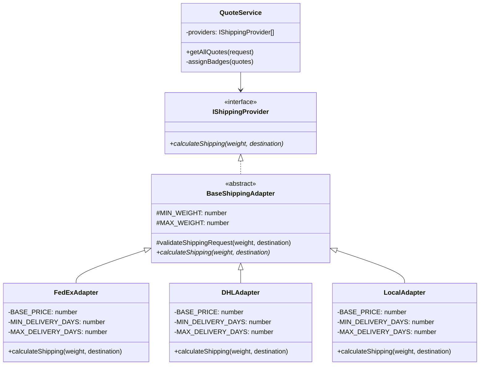
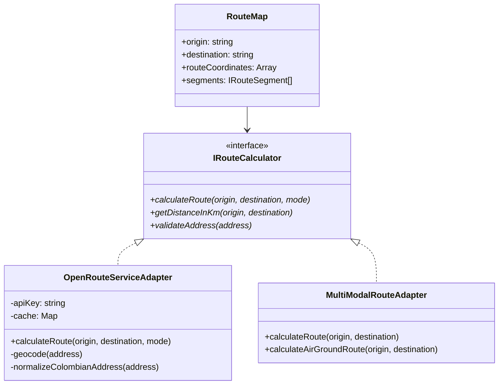
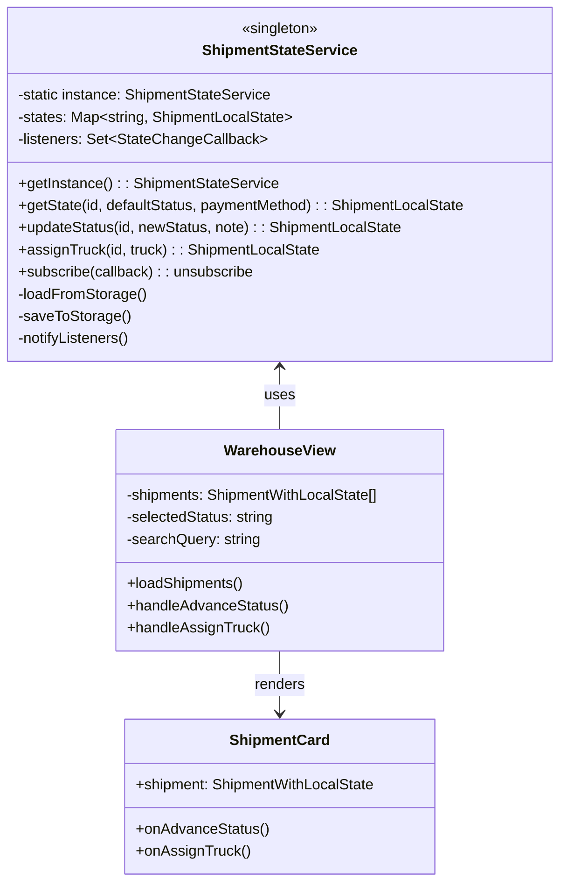

# Logistics Shipping Optimizer - Architecture

## Tech Stack
- **Backend:** Express.js + TypeScript
- **Frontend:** React + TypeScript + Vite
- **Database:** MongoDB + Mongoose ODM
- **Patterns:** 
  - **Template Method Pattern** (multi-provider shipping with shared validation logic)
  - **Repository Pattern** (data persistence abstraction)

---

## Template Method Pattern Implementation

The system uses the **Template Method Pattern** to define a skeleton algorithm in the base class (`BaseShippingAdapter`) while allowing subclasses to override specific steps without changing the algorithm's structure.

### Class Diagram


### Pattern Benefits

1. **Code Reuse (DRY):** Common validation logic (`validateShippingRequest`) is implemented once in `BaseShippingAdapter`
2. **Consistency:** All adapters follow the same validation rules (weight: 0.1-1000 kg, non-empty destination)
3. **Extensibility:** New providers only need to implement `calculateShipping()` without duplicating validation
4. **SOLID Compliance:** Single Responsibility (each adapter handles one provider), Open/Closed (extend BaseShippingAdapter without modifying it)

---

## Folder Structure - Clean Architecture

```
shipping-optimizer/
├── logistics-back/
│   ├── src/
│   │   ├── domain/
│   │   │   ├── entities/
│   │   │   │   ├── Shipment.ts
│   │   │   │   ├── Quote.ts
│   │   │   └── interfaces/
│   │   │       ├── IShippingProvider.ts
│   │   │       └── IRepository.ts
│   │   ├── application/
│   │   │   ├── services/
│   │   │   │   ├── ShippingService.ts
│   │   │   │   └── QuoteService.ts
│   │   │   └── use-cases/
│   │   │       ├── CalculateShippingUseCase.ts
│   │   │       └── TrackShipmentUseCase.ts
│   │   ├── infrastructure/
│   │   │   ├── adapters/
│   │   │   │   ├── FedExAdapter.ts
│   │   │   │   ├── DHLAdapter.ts
│   │   │   │   └── LocalAdapter.ts
│   │   │   ├── controllers/
│   │   │   │   ├── ShippingController.ts
│   │   │   │   └── QuoteController.ts
│   │   │   ├── routes/
│   │   │   │   ├── shipping.routes.ts
│   │   │   │   └── quotes.routes.ts
│   │   │   └── database/
│   │   │       ├── models/
│   │   │       │   ├── QuoteModel.ts
│   │   │       │   └── ShipmentModel.ts
│   │   │       ├── repositories/
│   │   │       │   ├── QuoteRepository.ts
│   │   │       │   └── ShipmentRepository.ts
│   │   │       └── connection.ts
│   │   └── main.ts
│   └── package.json
└── logistics-front/
    ├── src/
    │   ├── components/         # React UI components (forms, widgets, alerts)
    │   ├── hooks/              # Custom React hooks (form validation, provider status)
    │   ├── models/             # TypeScript interfaces (Quote, QuoteRequest)
    │   ├── services/           # API service layer (direct fetch calls)
    │   │   └── quoteService.ts # Request quotes from backend
    │   ├── utils/              # Utilities and configuration
    │   │   ├── adapters/       # Data transformation adapters
    │   │   ├── validation/     # Form validation logic
    │   │   ├── constants.ts    # API URLs and configuration
    │   │   └── providerConfig.ts # Provider metadata (colors, logos)
    │   ├── App.tsx             # Main application component
    │   └── main.tsx            # React entry point
    └── package.json
```

---

## Data Contracts (TypeScript Interfaces)

### IQuote - Standardized Quote Response

Every adapter must normalize its provider's raw response to this structure:

```typescript
interface IQuote {
  providerId: string;      // e.g., 'fedex-ground'
  providerName: string;    // e.g., 'FedEx Ground'
  price: number;           // e.g., 32.80
  currency: string;        // e.g., 'USD'
  minDays: number;         // e.g., 3
  maxDays: number;         // e.g., 4
  transportMode: string;   // e.g., 'Truck', 'Air Freight'
  isCheapest: boolean;     // Computed by Service
  isFastest: boolean;      // Computed by Service
}
```

### IShippingProvider - Adapter Interface

```typescript
interface IShippingProvider {
  calculateShipping(weight: number, destination: string): Promise<IQuote>;
  trackShipment(trackingId: string): Promise<TrackingInfo>;
  validateAddress(address: string): Promise<boolean>;
}
```

### Edge Cases & Validation Rules

| Case | Input Condition | Expected Behavior |
|:---|:---|:---|
| **Invalid Weight** | `weight <= 0` | Throw `ValidationError`: "Weight must be > 0.1 kg" |
| **Past Date** | `pickupDate < current_date` | Throw `ValidationError`: "Date cannot be in the past" |
| **Provider Timeout** | One adapter fails (e.g., FedEx) | Return quotes from DHL/Local + Log error |
| **Extreme Weight** | `weight > 1000kg` | Throw `ValidationError`: "Weight must be ≤ 1000 kg" |
| **Empty Address** | `originAddress == ""` | Throw `ValidationError`: "Origin/Destination required" |

---

## Key Principles

- **Template Method Pattern:** `BaseShippingAdapter` defines common validation logic; subclasses implement provider-specific pricing
- **Single Responsibility:** Each adapter handles one provider only
- **DRY (Don't Repeat Yourself):** Validation logic is centralized in the base class
- **Dependency Injection:** `QuoteService` receives providers via constructor
- **Abstraction:** Controllers depend on interfaces (`IShippingProvider`), not implementations
- **Repository Pattern:** Data access abstraction with `IQuoteRepository`
- **Separation of Concerns (Backend):** Domain ≠ Application ≠ Infrastructure
- **YAGNI Principle (Frontend):** Flat structure, no over-engineering for academic scope
- **Frontend Simplicity:** Direct imports, no ServiceFactory, no Context for single function

---

## Data Flow
- **Request:** React → Direct fetch → Express Controller → Service → Adapter → Provider
- **Response:** Provider → Adapter → Service → Controller → JSON → React UI

---

## Extension Points
- **Add new shipping provider:** Extend `BaseShippingAdapter` and implement `calculateShipping()` method
- **Add new domain entity:** Define in `domain/entities/`, create repository interface
- **Add new validation rule:** Update `validateShippingRequest()` in `BaseShippingAdapter`
- **Add new pricing tier:** Modify `WeightPricingCalculator` with new tier configuration

---

## 🆕 Nuevas Funcionalidades v2.0

### 1. Sistema de Mapas Interactivos (RouteMap)

Integración con OpenStreetMap y OpenRouteService para visualización de rutas.

#### Arquitectura del Componente



#### Patrones Implementados

| Patrón | Aplicación | Beneficio |
|--------|------------|-----------|
| **Adapter** | `OpenRouteServiceAdapter` adapta API externa | Desacoplamiento de proveedor externo |
| **Strategy** | Múltiples estrategias de geocodificación | Fallback automático para direcciones colombianas |
| **Cache** | Cache interno con TTL | Reduce llamadas API y mejora rendimiento |

#### Principios SOLID

```typescript
// SRP: Cada método tiene una única responsabilidad
class OpenRouteServiceAdapter {
  // Solo calcula rutas
  async calculateRoute() { }
  
  // Solo geocodifica
  private async geocode() { }
  
  // Solo normaliza direcciones colombianas
  private normalizeColombianAddress() { }
}

// OCP: Extensible sin modificar
// Nuevos proveedores implementan IRouteCalculator
class GoogleMapsAdapter implements IRouteCalculator { }

// DIP: Dependencia de abstracción
class QuoteService {
  constructor(
    private routeCalculator: IRouteCalculator  // Interfaz, no implementación
  ) { }
}
```

---

### 2. Sistema de Creación de Envíos (ShipmentWizard)

Flujo paso a paso para crear envíos con validación en tiempo real.

#### Arquitectura del Wizard

```
ShipmentWizard (Orquestador)
├── QuoteRequestForm      (Paso 1: Direcciones)
├── QuoteSelectionCard    (Paso 2: Cotizaciones)
├── ShipmentDetailsForm   (Paso 3: Datos Cliente)
├── PaymentForm           (Paso 4: Pago)
├── PaymentProcessingModal (Animación)
└── Confirmation          (Paso 5: Confirmación)
```

#### Patrones Implementados

| Patrón | Componente | Descripción |
|--------|------------|-------------|
| **Wizard/Steps** | `ShipmentWizard` | Flujo secuencial con navegación |
| **State Machine** | `PaymentProcessingModal` | Gestión de etapas de procesamiento |
| **Composite** | Formularios anidados | Composición de sub-formularios |
| **Observer** | `useEffect` hooks | Reacción a cambios de estado |

#### Principios SOLID en el Wizard

```typescript
// SRP: Cada componente = una responsabilidad
const QuoteRequestForm = () => { /* Solo captura datos de envío */ };
const PaymentForm = () => { /* Solo captura datos de pago */ };

// OCP: Extensible via props
interface ShipmentWizardProps {
  selectedQuote?: IQuote;     // Puede iniciar desde paso específico
  quoteRequest?: IQuoteRequest;
  onBack?: () => void;        // Comportamiento personalizable
}

// ISP: Interfaces mínimas y enfocadas
interface PaymentFormProps {
  amount: number;             // Solo lo necesario
  onSubmit: (data) => void;
  onBack: () => void;
  isLoading: boolean;
}

// LSP: Componentes intercambiables
// Cualquier formulario puede reemplazarse sin romper el wizard
<ShipmentWizard>
  {currentStep === 'payment' && <PaymentForm {...props} />}
  {/* Podría ser <StripePaymentForm {...props} /> */}
</ShipmentWizard>
```

#### Validación con Debouncing

```typescript
// Evita validaciones excesivas durante typing
const useQuoteFormState = () => {
  const debouncedValidate = useDebouncedCallback(
    (field, value) => validateField(field, value),
    300  // 300ms debounce
  );
  
  const handleChange = (field, value) => {
    setFormData(prev => ({ ...prev, [field]: value }));
    debouncedValidate(field, value);
  };
};
```

---

### 3. Sistema de Gestión de Almacén (WarehouseView)

Panel centralizado para gestión de envíos con estados manuales.

#### Arquitectura del Sistema



#### Patrones de Diseño Implementados

##### Singleton Pattern
```typescript
class ShipmentStateService {
  private static instance: ShipmentStateService;
  
  private constructor() {
    this.loadFromStorage();  // Inicialización privada
  }
  
  public static getInstance(): ShipmentStateService {
    if (!ShipmentStateService.instance) {
      ShipmentStateService.instance = new ShipmentStateService();
    }
    return ShipmentStateService.instance;
  }
}

// Uso: Siempre la misma instancia
const service = ShipmentStateService.getInstance();
```

##### Observer Pattern
```typescript
class ShipmentStateService {
  private listeners: Set<StateChangeCallback> = new Set();
  
  // Suscripción
  public subscribe(callback: StateChangeCallback): () => void {
    this.listeners.add(callback);
    return () => this.listeners.delete(callback);  // Retorna unsubscribe
  }
  
  // Notificación
  private notifyListeners(shipmentId: string, state: ShipmentLocalState): void {
    this.listeners.forEach(callback => callback(shipmentId, state));
  }
}

// En componentes React:
useEffect(() => {
  const unsubscribe = shipmentStateService.subscribe((id, newState) => {
    setShipments(prev => prev.map(s => 
      s.id === id ? { ...s, localState: newState } : s
    ));
  });
  return unsubscribe;
}, []);
```

##### Repository Pattern
```typescript
class ShipmentStateService {
  private readonly STORAGE_KEY = 'warehouse_shipment_states';
  
  // Carga desde repositorio (localStorage)
  private loadFromStorage(): void {
    const stored = localStorage.getItem(this.STORAGE_KEY);
    if (stored) {
      const parsed = JSON.parse(stored);
      Object.entries(parsed).forEach(([id, state]) => {
        this.states.set(id, state);
      });
    }
  }
  
  // Guarda en repositorio
  private saveToStorage(): void {
    const obj: Record<string, ShipmentLocalState> = {};
    this.states.forEach((state, id) => { obj[id] = state; });
    localStorage.setItem(this.STORAGE_KEY, JSON.stringify(obj));
  }
}
```

##### State Machine Pattern (Flujo de Estados)
```typescript
// Definición del flujo válido de estados
const STATUS_FLOW: ShipmentStatusType[] = [
  'PAYMENT_CONFIRMED',
  'PREPARING',
  'READY_FOR_PICKUP',
  'IN_TRANSIT',
  'OUT_FOR_DELIVERY',
  'DELIVERED',
];

const TERMINAL_STATES: ShipmentStatusType[] = [
  'DELIVERED',
  'FAILED_DELIVERY',
  'RETURNED',
];

// Validación de transición
public isValidTransition(current: ShipmentStatusType, next: ShipmentStatusType): boolean {
  // Estados terminales no pueden transicionar
  if (TERMINAL_STATES.includes(current)) return false;
  
  // Solo permite avanzar en el flujo
  const currentIndex = STATUS_FLOW.indexOf(current);
  const nextIndex = STATUS_FLOW.indexOf(next);
  return nextIndex > currentIndex;
}
```

#### Principios SOLID en el Almacén

```typescript
// SRP: Cada servicio/componente tiene una responsabilidad
ShipmentStateService    → Solo gestiona estado local
shipmentService         → Solo interactúa con API
WarehouseView          → Solo orquesta la UI
ShipmentCard           → Solo presenta un envío

// OCP: Extensible sin modificar
// Nuevos estados se agregan a STATUS_FLOW sin cambiar lógica
const STATUS_FLOW = [...existingStates, 'NEW_STATE'];

// ISP: Interfaces segregadas
interface TruckAssignmentProps {
  shipment: ShipmentWithLocalState;
  onAssignTruck: (id: string, truck: Truck) => void;
  onRemoveTruck: (id: string) => void;
}

// DIP: Dependencia de abstracciones
const WarehouseView = () => {
  // Depende del servicio abstracto, no de localStorage directamente
  const service = shipmentStateService;
};
```

---

### 4. Sistema de Procesamiento de Pagos (PaymentProcessingModal)

Animación profesional de procesamiento con generación de factura.

#### State Machine del Procesamiento

```
┌─────────────────────────────────────────────────────────────────┐
│                    CARD PAYMENT FLOW                            │
├─────────────────────────────────────────────────────────────────┤
│  validating → processing → confirming → generating → success    │
│     🔐           🏦           ✓           📄          ✅        │
│   (1.2s)       (1.5s)      (1.3s)       (1.0s)                 │
└─────────────────────────────────────────────────────────────────┘

┌─────────────────────────────────────────────────────────────────┐
│                    CASH PAYMENT FLOW                            │
├─────────────────────────────────────────────────────────────────┤
│     validating → processing → generating → success              │
│        📋           💵           📄          ✅                 │
│       (0.8s)       (1.0s)       (1.2s)                         │
└─────────────────────────────────────────────────────────────────┘
```

#### Patrones Implementados

| Patrón | Aplicación |
|--------|------------|
| **State Machine** | Secuencia de etapas de procesamiento |
| **Strategy** | Diferentes flujos para tarjeta vs efectivo |
| **Factory** | Generación de datos de factura |

```typescript
// Factory para número de factura
const generateInvoiceNumber = (): string => {
  const date = new Date();
  const year = date.getFullYear();
  const month = String(date.getMonth() + 1).padStart(2, '0');
  const random = Math.floor(Math.random() * 10000).toString().padStart(4, '0');
  return `FAC-${year}${month}-${random}`;
};

// Strategy: Diferentes pasos según método de pago
const CARD_STEPS: ProcessingStep[] = [
  { stage: 'validating', label: 'Validando datos...', duration: 1200 },
  { stage: 'processing', label: 'Conectando banco...', duration: 1500 },
  // ...
];

const CASH_STEPS: ProcessingStep[] = [
  { stage: 'validating', label: 'Verificando pedido...', duration: 800 },
  // ... (flujo más corto)
];

const steps = paymentMethod === 'CARD' ? CARD_STEPS : CASH_STEPS;
```

---

## 🎨 Diseño UI/UX Moderno

### Sistema de Colores (CSS Variables)

```css
@theme {
  --color-primary: #2563eb;
  --color-secondary: #4f46e5;
  --color-background-light: #f8fafc;
  --color-card-light: #ffffff;
  --color-text-dark: #1e293b;
  --color-text-muted: #64748b;
  --color-border-light: #e2e8f0;
  --color-accent-success: #10b981;
  --color-accent-warning: #f59e0b;
  --color-accent-info: #3b82f6;
}
```

### Componentes con Gradientes y Sombras

```typescript
// Tarjetas con estilo moderno
<div className="bg-white rounded-2xl border border-slate-200/80 shadow-sm 
                hover:shadow-xl transition-shadow">

// Badges con colores por estado
const STATUS_CONFIG = {
  DELIVERED: { 
    bgColor: 'bg-green-100', 
    color: 'text-green-700', 
    icon: '✅' 
  },
  IN_TRANSIT: { 
    bgColor: 'bg-indigo-100', 
    color: 'text-indigo-700', 
    icon: '🚚' 
  },
};
```

---

## 📊 Métricas de Calidad

| Métrica | Target | Estado |
|---------|--------|--------|
| Test Coverage | 80%+ | ✅ |
| Code Duplication | < 3% | ✅ |
| Security Hotspots | 0 | ✅ |
| SOLID Compliance | 100% | ✅ |
| Design Patterns | 8+ | ✅ |

---

## 🔗 Documentación Relacionada

- [TDD_GUIDE.md](TDD_GUIDE.md) - Guía de Test-Driven Development
- [USER_STORIES.md](USER_STORIES.md) - Historias de usuario originales
- [NEW_HU.md](NEW_HU.md) - Nuevas historias de usuario v2.0
