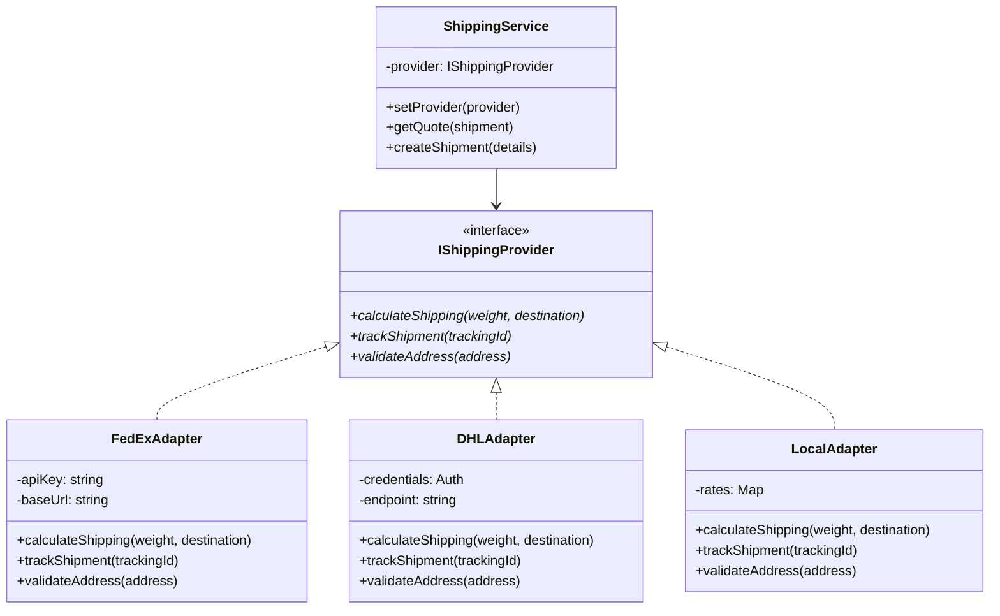

# Logistics Shipping Optimizer - Architecture

## Tech Stack
- **Backend:** Express.js + TypeScript
- **Frontend:** React + TypeScript + Vite
- **Database:** MongoDB + Mongoose ODM
- **Pattern:** Adapter Pattern (multi-provider shipping support) + Repository Pattern (data persistence)

---

## Adapter Pattern Implementation

### Class Diagram


---

## Folder Structure - Clean Architecture

```
shipping-optimizer/
├── logistics-back/
│   ├── src/
│   │   ├── domain/
│   │   │   ├── entities/
│   │   │   │   ├── Shipment.ts
│   │   │   │   ├── Quote.ts
│   │   │   └── interfaces/
│   │   │       ├── IShippingProvider.ts
│   │   │       └── IRepository.ts
│   │   ├── application/
│   │   │   ├── services/
│   │   │   │   ├── ShippingService.ts
│   │   │   │   └── QuoteService.ts
│   │   │   └── use-cases/
│   │   │       ├── CalculateShippingUseCase.ts
│   │   │       └── TrackShipmentUseCase.ts
│   │   ├── infrastructure/
│   │   │   ├── adapters/
│   │   │   │   ├── FedExAdapter.ts
│   │   │   │   ├── DHLAdapter.ts
│   │   │   │   └── LocalAdapter.ts
│   │   │   ├── controllers/
│   │   │   │   ├── ShippingController.ts
│   │   │   │   └── QuoteController.ts
│   │   │   ├── routes/
│   │   │   │   ├── shipping.routes.ts
│   │   │   │   └── quotes.routes.ts
│   │   │   └── database/
│   │   │       ├── models/
│   │   │       │   ├── QuoteModel.ts
│   │   │       │   └── ShipmentModel.ts
│   │   │       ├── repositories/
│   │   │       │   ├── QuoteRepository.ts
│   │   │       │   └── ShipmentRepository.ts
│   │   │       └── connection.ts
│   │   └── main.ts
│   └── package.json
└── logistics-front/
    ├── src/
    │   ├── domain/
    │   │   └── models/ (Type definitions)
    │   ├── presentation/
    │   │   ├── components/
    │   │   ├── pages/
    │   │   └── hooks/
    │   ├── services/
    │   │   └── api.client.ts
    │   └── App.tsx
    └── package.json
```

---

## Data Contracts (TypeScript Interfaces)

### IQuote - Standardized Quote Response

Every adapter must normalize its provider's raw response to this structure:

```typescript
interface IQuote {
  providerId: string;      // e.g., 'fedex-ground'
  providerName: string;    // e.g., 'FedEx Ground'
  price: number;           // e.g., 32.80
  currency: string;        // e.g., 'USD'
  minDays: number;         // e.g., 3
  maxDays: number;         // e.g., 4
  transportMode: string;   // e.g., 'Truck', 'Air Freight'
  isCheapest: boolean;     // Computed by Service
  isFastest: boolean;      // Computed by Service
}
```

### IShippingProvider - Adapter Interface

```typescript
interface IShippingProvider {
  calculateShipping(weight: number, destination: string): Promise<IQuote>;
  trackShipment(trackingId: string): Promise<TrackingInfo>;
  validateAddress(address: string): Promise<boolean>;
}
```

### Edge Cases & Validation Rules

| Case | Input Condition | Expected Behavior |
|:---|:---|:---|
| **Invalid Weight** | `weight <= 0` | Throw `ValidationError`: "Weight must be > 0.1 kg" |
| **Past Date** | `pickupDate < current_date` | Throw `ValidationError`: "Date cannot be in the past" |
| **Provider Timeout** | One adapter fails (e.g., FedEx) | Return quotes from DHL/Local + Log error |
| **Extreme Weight** | `weight > 1000kg` | Throw `ValidationError`: "Weight must be ≤ 1000 kg" |
| **Empty Address** | `originAddress == ""` | Throw `ValidationError`: "Origin/Destination required" |

---

## Key Principles

- **Single Responsibility:** Each adapter handles one provider only
- **Dependency Injection:** ShippingService receives provider via constructor
- **Abstraction:** Controllers depend on interfaces, not implementations
- **Repository Pattern:** Data access abstraction with `IQuoteRepository`, `IShipmentRepository`
- **Separation of Concerns:** Domain ≠ Application ≠ Infrastructure
- **Frontend Agnostic:** React consumes REST API via service layer

---

## Data Flow
- **Request:** React → API Client → Express Controller → Service → Adapter → Provider
- **Response:** Provider → Adapter → Service → Controller → JSON → React UI

---

## Extension Points
- Add new shipping provider: Create new adapter implementing `IShippingProvider`
- Add new domain entity: Define in `domain/entities/`, extend repository
- Add new use case: Create in `application/use-cases/`, inject dependencies

