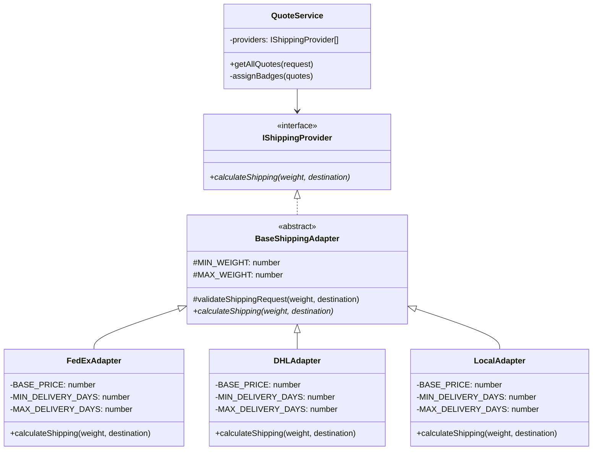

# Logistics Shipping Optimizer - Architecture

## Tech Stack
- **Backend:** Express.js + TypeScript
- **Frontend:** React + TypeScript + Vite
- **Database:** MongoDB + Mongoose ODM
- **Patterns:** 
  - **Template Method Pattern** (multi-provider shipping with shared validation logic)
  - **Repository Pattern** (data persistence abstraction)

---

## Template Method Pattern Implementation

The system uses the **Template Method Pattern** to define a skeleton algorithm in the base class (`BaseShippingAdapter`) while allowing subclasses to override specific steps without changing the algorithm's structure.

### Class Diagram


### Pattern Benefits

1. **Code Reuse (DRY):** Common validation logic (`validateShippingRequest`) is implemented once in `BaseShippingAdapter`
2. **Consistency:** All adapters follow the same validation rules (weight: 0.1-1000 kg, non-empty destination)
3. **Extensibility:** New providers only need to implement `calculateShipping()` without duplicating validation
4. **SOLID Compliance:** Single Responsibility (each adapter handles one provider), Open/Closed (extend BaseShippingAdapter without modifying it)

---

## Folder Structure - Clean Architecture

```
shipping-optimizer/
├── logistics-back/
│   ├── src/
│   │   ├── domain/
│   │   │   ├── entities/
│   │   │   │   ├── Shipment.ts
│   │   │   │   ├── Quote.ts
│   │   │   └── interfaces/
│   │   │       ├── IShippingProvider.ts
│   │   │       └── IRepository.ts
│   │   ├── application/
│   │   │   ├── services/
│   │   │   │   ├── ShippingService.ts
│   │   │   │   └── QuoteService.ts
│   │   │   └── use-cases/
│   │   │       ├── CalculateShippingUseCase.ts
│   │   │       └── TrackShipmentUseCase.ts
│   │   ├── infrastructure/
│   │   │   ├── adapters/
│   │   │   │   ├── FedExAdapter.ts
│   │   │   │   ├── DHLAdapter.ts
│   │   │   │   └── LocalAdapter.ts
│   │   │   ├── controllers/
│   │   │   │   ├── ShippingController.ts
│   │   │   │   └── QuoteController.ts
│   │   │   ├── routes/
│   │   │   │   ├── shipping.routes.ts
│   │   │   │   └── quotes.routes.ts
│   │   │   └── database/
│   │   │       ├── models/
│   │   │       │   ├── QuoteModel.ts
│   │   │       │   └── ShipmentModel.ts
│   │   │       ├── repositories/
│   │   │       │   ├── QuoteRepository.ts
│   │   │       │   └── ShipmentRepository.ts
│   │   │       └── connection.ts
│   │   └── main.ts
│   └── package.json
└── logistics-front/
    ├── src/
    │   ├── components/         # React UI components (forms, widgets, alerts)
    │   ├── hooks/              # Custom React hooks (form validation, provider status)
    │   ├── models/             # TypeScript interfaces (Quote, QuoteRequest)
    │   ├── services/           # API service layer (direct fetch calls)
    │   │   └── quoteService.ts # Request quotes from backend
    │   ├── utils/              # Utilities and configuration
    │   │   ├── adapters/       # Data transformation adapters
    │   │   ├── validation/     # Form validation logic
    │   │   ├── constants.ts    # API URLs and configuration
    │   │   └── providerConfig.ts # Provider metadata (colors, logos)
    │   ├── App.tsx             # Main application component
    │   └── main.tsx            # React entry point
    └── package.json
```

---

## Data Contracts (TypeScript Interfaces)

### IQuote - Standardized Quote Response

Every adapter must normalize its provider's raw response to this structure:

```typescript
interface IQuote {
  providerId: string;      // e.g., 'fedex-ground'
  providerName: string;    // e.g., 'FedEx Ground'
  price: number;           // e.g., 32.80
  currency: string;        // e.g., 'USD'
  minDays: number;         // e.g., 3
  maxDays: number;         // e.g., 4
  transportMode: string;   // e.g., 'Truck', 'Air Freight'
  isCheapest: boolean;     // Computed by Service
  isFastest: boolean;      // Computed by Service
}
```

### IShippingProvider - Adapter Interface

```typescript
interface IShippingProvider {
  calculateShipping(weight: number, destination: string): Promise<IQuote>;
  trackShipment(trackingId: string): Promise<TrackingInfo>;
  validateAddress(address: string): Promise<boolean>;
}
```

### Edge Cases & Validation Rules

| Case | Input Condition | Expected Behavior |
|:---|:---|:---|
| **Invalid Weight** | `weight <= 0` | Throw `ValidationError`: "Weight must be > 0.1 kg" |
| **Past Date** | `pickupDate < current_date` | Throw `ValidationError`: "Date cannot be in the past" |
| **Provider Timeout** | One adapter fails (e.g., FedEx) | Return quotes from DHL/Local + Log error |
| **Extreme Weight** | `weight > 1000kg` | Throw `ValidationError`: "Weight must be ≤ 1000 kg" |
| **Empty Address** | `originAddress == ""` | Throw `ValidationError`: "Origin/Destination required" |

---

## Key Principles

- **Template Method Pattern:** `BaseShippingAdapter` defines common validation logic; subclasses implement provider-specific pricing
- **Single Responsibility:** Each adapter handles one provider only
- **DRY (Don't Repeat Yourself):** Validation logic is centralized in the base class
- **Dependency Injection:** `QuoteService` receives providers via constructor
- **Abstraction:** Controllers depend on interfaces (`IShippingProvider`), not implementations
- **Repository Pattern:** Data access abstraction with `IQuoteRepository`
- **Separation of Concerns (Backend):** Domain ≠ Application ≠ Infrastructure
- **YAGNI Principle (Frontend):** Flat structure, no over-engineering for academic scope
- **Frontend Simplicity:** Direct imports, no ServiceFactory, no Context for single function

---

## Data Flow
- **Request:** React → Direct fetch → Express Controller → Service → Adapter → Provider
- **Response:** Provider → Adapter → Service → Controller → JSON → React UI

---

## Extension Points
- **Add new shipping provider:** Extend `BaseShippingAdapter` and implement `calculateShipping()` method
- **Add new domain entity:** Define in `domain/entities/`, create repository interface
- **Add new validation rule:** Update `validateShippingRequest()` in `BaseShippingAdapter`
- **Add new pricing tier:** Modify `WeightPricingCalculator` with new tier configuration

